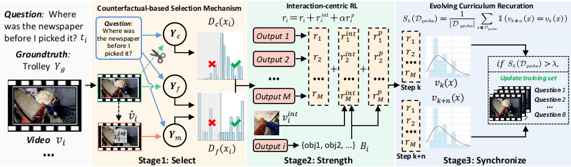
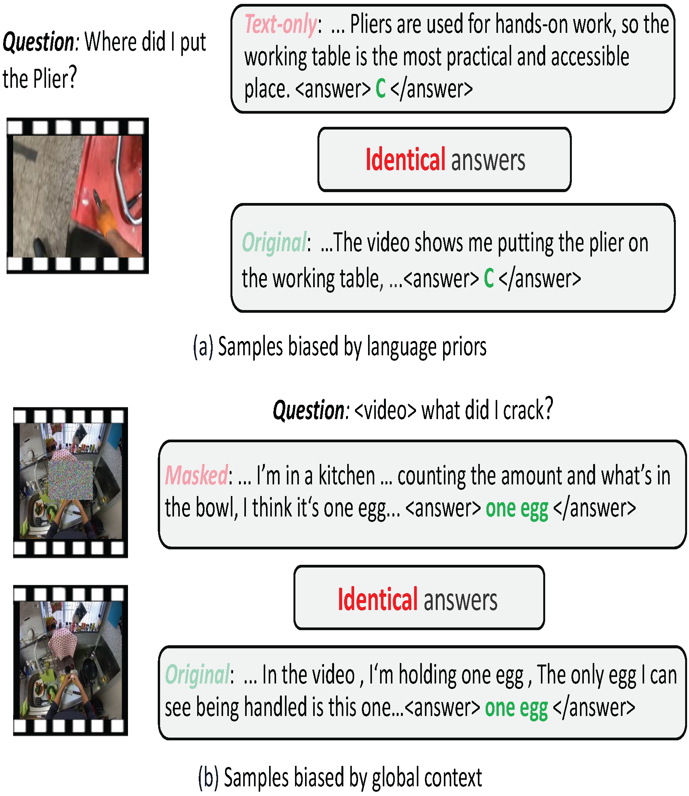
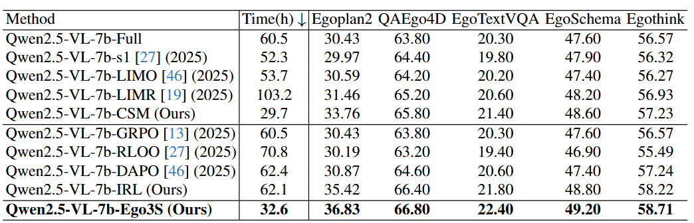

# Ego3S: Select, Strengthen, and Synchronize for Efficient Egocentric Reasoning

## Introduction
This is the source code for "Ego3S: Select, Strengthen, and Synchronize for Efficient Egocentric Reasoning"


## Ego3S: Select, Strengthen, and Synchronize for Efficient Egocentric Reasoning

Egocentric reasoning fundamentally differs from third-person understanding in LVLMs. Our Ego3S framework addresses the critical challenge of "inertia thinking" where models over-rely on language priors and global context rather than focusing on immediate visual interaction cues.



## Proposed Model (Ego3S)

Our three-stage framework comprises:

* **Counterfactual-based Selection Mechanism (CSM)**: Filters training samples to identify high-value data requiring genuine interaction-grounded reasoning
* **Interaction-centric Reinforcement Learning (IRL)**: Strengthens model attention to localized interaction cues through explicit rewards
* **Evolving Curriculum Recuration (ECR)**: Dynamically synchronizes data selection with evolving model competence

## Motivation



Illustrative examples of existing problems in egocentric reasoning:
- **(a) Inertia Thinking**: Models fail to focus on interaction cues, relying instead on generic context
- **(b) Spurious Context Shortcuts**: Training samples solvable via language priors or global context without interaction understanding
- **(c) Reward-Reality Mismatch**: Current RL objectives assign identical rewards to vastly different reasoning quality

## Key Features

- **26.5% Data Efficiency**: Achieves state-of-the-art performance using only 3,180 samples vs. 12,000 full dataset
- **46% Computational Savings**: Reduces training time from 60.5h to 32.6h
- **Superior Performance**: Consistent improvements across 5 egocentric benchmarks
- **Cross-Model Generalization**: Effective across different LVLM architectures

## Results



Performance comparison showing Ego3S outperforms:
- Data selection methods (s1, LIMO, LIMR)
- RL strategies (GRPO, RLOO, DAPO)
- Full dataset training baseline


### Hardware Requirements
- CUDA 12.0+
- PyTorch 2.6.0+

## Setup

```bash
pip install -e .
```

### Installation

```bash
cd Ego3S

# Install dependencies
pip install -r requirements.txt
```

## Usage

### Stage 1: Data Selection with CSM

Apply Counterfactual-based Selection Mechanism to identify high-value samples:

```bash
# Run selection pipeline
bash examples/qwen2_5_vl_7b_ego3s_selection.sh
```

### Stage 2: Sample Selection

Execute the selection algorithm:

```bash
python select/csm_selection.py --config configs/selection_config.yaml
```

### Stage 3: Training with IRL

Train with Interaction-centric Reinforcement Learning:

```bash
# GRPO training with interaction-centric rewards
bash examples/qwen2_5_vl_7b_ego3s_grpo.sh
```

### Stage 4: Dynamic Curriculum (ECR)

The Evolving Curriculum Recuration runs automatically during training, monitoring reward variance and refreshing data when stagnation is detected.

## Datasets

### Training Data

**Ego4D Dataset**: Download the [Ego4D dataset] and construct a subset of 12,000 samples covering:
- Open-ended QA (OpenQA) tasks
- Close-ended QA (CloseQA) tasks

Extract to your data path: `data/ego4d/`

### Evaluation Benchmarks

Our method is evaluated on five egocentric reasoning benchmarks:

1. **QAEgo4D**: Episodic memory-based question answering
2. **EgoTextVQA**: Scene-text aware video question answering
3. **EgoSchema**: Very long-form video language understanding
4. **Egoplan2**: Multi-modal planning in real-world scenarios
5. **Egothink**: First-person perspective thinking capability

## Models

Download the following base models:

- Qwen2.5-VL-7B-Instruct
- Qwen2.5-VL-3B-Instruct

Place models in `models/` directory.

## Evaluation

```bash
# Evaluate on multiple benchmarks
torchrun --nproc-per-node=8 run.py \
    --data QAEgo4D,EgoTextVQA,EgoSchema,Egoplan2,Egothink \
    --model Ego3S-Qwen2.5-VL-7B \
    --verbose
```

### Individual Benchmark Evaluation

```bash
# QAEgo4D
python eval/evaluate_qaego4d.py --model_path checkpoints/ego3s_qwen2.5_vl_7b

# EgoTextVQA
python eval/evaluate_egotextvqa.py --model_path checkpoints/ego3s_qwen2.5_vl_7b

# EgoSchema
python eval/evaluate_egoschema.py --model_path checkpoints/ego3s_qwen2.5_vl_7b
```

## Configuration

### Hyperparameters

Key hyperparameters for CSM (in `configs/selection_config.yaml`):

```yaml
# Coarse-grained filter threshold
lambda_c: 0.1

# Fine-grained filter threshold  
lambda_f: 0.5

# Interaction similarity threshold
lambda_o: 0.21
```

Key hyperparameters for IRL (in `configs/training_config.yaml`):

```yaml
# Learning rate
learning_rate: 1e-6

# Batch size
batch_size: 512

# Penalty coefficient
alpha: 0.5

# Max object mentions
N: 5

# Reward threshold
H: 1.1
```

Key hyperparameters for ECR:

```yaml
# Stagnation threshold
lambda_s: 0.6

# Monitoring interval (steps)
monitoring_interval: 100

# Probing set size
probing_set_size: 500
```

## Performance Metrics

### Efficiency Gains

- **Training Time**: 46% reduction (60.5h → 32.6h)
- **Data Usage**: 73.5% reduction (12,000 → 3,180 samples)
- **Performance**: +2.3% average improvement over LIMR

## Project Structure

```
Ego3S
├── fig
├── models
└── src
    ├── qwen-vl-utils
    ├── r1-v
    │   ├── configs
    │   ├── dataset
    │   ├── src
    │   ├── select
    │   │   ├── csm_selection.py
    │   │   ├── coarse_filter.py
    │   │   └── data_preprocesser.py
    │   ├── training
    │   │   ├── run_grpo_roi.sh
    │   │   ├── run_grpo.sh
    │   │   └── run_sft.py
    │   ├── curriculum
    │   │   ├── ecr_manager.py
    │   │   └── variance_monitor.py
    │   └── eval
    │       ├── evaluate_qaego4d.py
    │       ├── evaluate_egotextvqa.py
    │       └── evaluate_egoschema.py
    └── scripts
        ├── qwen2_5_vl_7b_ego3s_selection.sh
        ├── qwen2_5_vl_7b_ego3s_grpo.sh
        └── model_merger.py
```

## Key Insights

### Why Less Data Outperforms More?

Our analysis reveals:

1. **High-value samples** contain fewer easy instances but more challenging interaction-grounded reasoning
2. **CSM is not just difficulty filtering** - it specifically selects samples requiring visual interaction understanding
3. **Targeted selection** enables models to activate genuine egocentric reasoning capabilities

### Interaction Cue Utilization

Ego3S achieves 35%+ interaction cue utilization compared to 22% for baseline methods, demonstrating effective grounding in visual interaction evidence.


## Acknowledgments

This work builds upon:
- GRPO for reinforcement learning framework
- Ego4D for egocentric video dataset
- VLMEvalKit for evaluation framework

## License

This project is released under the MIT License.

## Contact

For questions and discussions, please open an issue or contact [contact information will be added after deanonymization].
